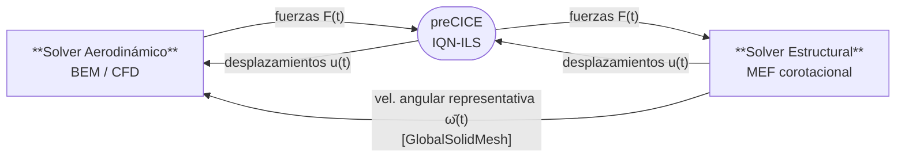
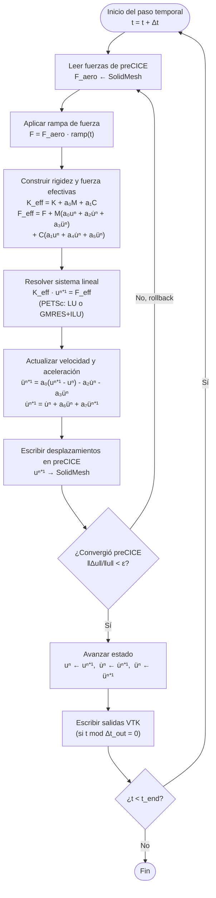
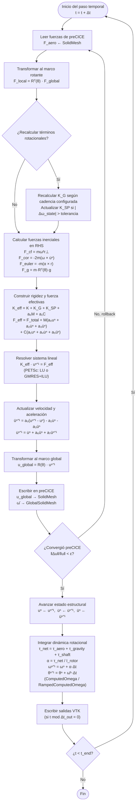

# Formulación Teórica del Solver Aeroelástico FSI para Rotores de Aerogeneradores

## Resumen

Este documento describe la formulación matemática completa del solver de interacción fluido-estructura (FSI) implementado en el módulo `aeroelast` para el análisis aeroelástico de palas de aerogeneradores. El objetivo principal del solver es evaluar cómo varía la señal de torque del aerogenerador cuando las palas se modelan como elementos estructurales elásticos —en lugar de cuerpos rígidos— sometidos a las cargas aerodinámicas calculadas mediante la Teoría del Elemento de Pala y la Cantidad de Movimiento (BEM). La formulación contempla dos casos de uso distintos: (i) el modelo de pala empotrada (`LinearDynamicFSI`) y (ii) el modelo corotacional del rotor completo (`LinearDynamicFSIRotor`).

Este texto debe leerse como un documento de referencia teoría-implementación: su propósito no es presentar la formulación más general posible, sino dejar explícito qué hipótesis físicas, qué simplificaciones y qué decisiones numéricas están efectivamente codificadas hoy en el solver. En consecuencia, cuando exista una diferencia entre una formulación más sofisticada disponible en la literatura y la discretización actualmente implementada, este documento prioriza describir con precisión la segunda. Esa trazabilidad deliberada permite reutilizar después este material como base para artículos con alcances distintos, extrayendo de aquí únicamente las piezas teóricas que correspondan a cada manuscrito.

---

## Tabla de contenidos

1. [Descripción general del problema](#1-descripción-general-del-problema)
2. [Modelo aerodinámico: Teoría BEM](#2-modelo-aerodinámico-teoría-bem)
3. [Modelo estructural: MEF con elementos de lámina](#3-modelo-estructural-mef-con-elementos-de-lámina)
4. [Marco corotacional para estructuras en rotación](#4-marco-corotacional-para-estructuras-en-rotación)
5. [Ecuación de movimiento en el marco rotante](#5-ecuación-de-movimiento-en-el-marco-rotante)
6. [Fuerzas inerciales en el marco rotante](#6-fuerzas-inerciales-en-el-marco-rotante)
7. [Rigidez geométrica por precarga centrífuga (K_G)](#7-rigidez-geométrica-por-precarga-centrífuga-k_g)
8. [Ablandamiento por giro (K_SP)](#8-ablandamiento-por-giro-k_sp)
9. [Amortiguamiento estructural: modelo de Rayleigh](#9-amortiguamiento-estructural-modelo-de-rayleigh)
10. [Integración temporal: método de Newmark-β](#10-integración-temporal-método-de-newmark-β)
11. [Acoplamiento FSI con preCICE](#11-acoplamiento-fsi-con-precice)
12. [Proyección de cargas BEM sobre la malla MEF](#12-proyección-de-cargas-bem-sobre-la-malla-mef)
13. [Retroalimentación de deformaciones al modelo BEM](#13-retroalimentación-de-deformaciones-al-modelo-bem)
14. [Dinámica del rotor: ecuación de torque y velocidad angular](#14-dinámica-del-rotor-ecuación-de-torque-y-velocidad-angular)
15. [Coeficientes de rendimiento aerodinámico](#15-coeficientes-de-rendimiento-aerodinámico)
16. [Hipótesis y limitaciones del modelo](#16-hipótesis-y-limitaciones-del-modelo)

---

## 1. Descripción general del problema

El análisis aeroelástico de una pala de aerogenerador requiere la solución simultánea de dos problemas físicos acoplados:

- **Problema fluido (aerodinámico):** Determinación de las fuerzas aerodinámicas distribuidas a lo largo de la pala en función de la geometría deformada y las condiciones de operación (velocidad de viento, velocidad angular, ángulo de paso).

- **Problema sólido (estructural):** Determinación de los desplazamientos elásticos de la pala bajo la acción de las fuerzas aerodinámicas y las fuerzas inerciales debidas a la rotación.

La retroalimentación entre ambos problemas (la deformación de la pala modifica las cargas aerodinámicas, y estas últimas determinan la deformación) define el problema de interacción fluido-estructura (FSI). La arquitectura del solver se ilustra en la Figura 1.



*Figura 1. Arquitectura de acoplamiento FSI.*

Existen dos configuraciones de solver implementadas:

| Configuración | Clase | Caso de uso |
|---|---|---|
| Pala empotrada | `LinearDynamicFSISolver` | Pala individual con extremo libre, raíz fija. Fuerzas desde CFD (OpenFOAM) vía preCICE. |
| Rotor completo | `LinearDynamicFSIRotorSolver` | Pala en marco corotacional, velocidad angular variable, fuerzas desde CFD o BEM vía preCICE. |

---

## 2. Modelo aerodinámico: Teoría BEM

### 2.1 Fundamentos de la Teoría del Elemento de Pala y la Cantidad de Movimiento

La Teoría del Elemento de Pala y la Cantidad de Movimiento (BEM, *Blade Element Momentum theory*) combina la ecuación de cantidad de movimiento axial para un disco actuador con el análisis local de las secciones aerodinámicas.

**Hipótesis del disco actuador.** La pala extrae energía del viento de forma axisimétrica. El balance de cantidad de movimiento en la dirección axial sobre un anillo de radio $r$ y anchura $dr$ da:

$$dT = 4\pi\,r\,\rho\,V_\infty^2\,a\,(1-a)\,dr$$

$$dQ = 4\pi\,r^3\,\rho\,V_\infty\,\omega\,a'\,(1-a)\,dr$$

donde:
- $V_\infty$ es la velocidad de viento libre [m/s],
- $\omega$ es la velocidad angular del rotor [rad/s],
- $a$ es el factor de inducción axial,
- $a'$ es el factor de inducción tangencial.

**Análisis del elemento de pala.** Para una sección aerodinámico a radio $r$, la velocidad relativa de entrada tiene componentes:

$$V_{axial} = V_\infty(1 - a), \qquad V_{tan} = \omega r (1 + a')$$

La velocidad relativa resultante y el ángulo de entrada son:

$$W = \sqrt{V_{axial}^2 + V_{tan}^2}, \qquad \phi = \arctan\!\left(\frac{V_{axial}}{V_{tan}}\right)$$

El ángulo de ataque local es:

$$\alpha = \phi - \theta$$

donde $\theta$ es la torsión geométrica local de la pala (suma del twist de referencia más el ángulo de paso colectivo $\beta$).

Las fuerzas aerodinámicas por unidad de longitud en la sección son:

$$L = \tfrac{1}{2}\rho W^2\,c\,C_l(\alpha, Re), \qquad D = \tfrac{1}{2}\rho W^2\,c\,C_d(\alpha, Re)$$

donde $c$ es la cuerda local y $C_l$, $C_d$ son los coeficientes de sustentación y arrastre interpolados de las polares del perfil a número de Reynolds $Re = \rho W c / \mu$.

Proyectando sobre los ejes normal y tangencial al plano del rotor:

$$N_p = L\cos\phi + D\sin\phi, \qquad T_p = L\sin\phi - D\cos\phi$$

### 2.2 Correcciones de pérdida en punta y raíz

La solución BEM incluye las correcciones de pérdida en punta de Prandtl (corrección de Glauert) y pérdida en raíz mediante factores de pérdida $F_{tip}$ y $F_{hub}$:

$$F = F_{tip} \cdot F_{hub}$$

$$F_{tip} = \frac{2}{\pi}\arccos\!\left(\exp\!\left[-\frac{B(R-r)}{2r\sin\phi}\right]\right)$$

$$F_{hub} = \frac{2}{\pi}\arccos\!\left(\exp\!\left[-\frac{B(r-R_{hub})}{2R_{hub}\sin\phi}\right]\right)$$

donde $B$ es el número de palas, $R$ es el radio del rotor y $R_{hub}$ es el radio del buje.

### 2.3 Sistema de ecuaciones BEM

La solución iterativa del sistema BEM se obtiene igualando las expresiones de cantidad de movimiento con las del elemento de pala. Para el factor de inducción axial (sin corrección de alta inducción):

$$a = \frac{1}{\dfrac{4F\sin^2\phi}{\sigma C_n} + 1}$$

$$a' = \frac{1}{\dfrac{4F\sin\phi\cos\phi}{\sigma C_t} - 1}$$

donde $\sigma = Bc/(2\pi r)$ es la solidez local y $C_n = C_l\cos\phi + C_d\sin\phi$, $C_t = C_l\sin\phi - C_d\cos\phi$.

El proceso iterativo continúa hasta convergencia en $(a, a')$ con tolerancia $10^{-6}$. La implementación utiliza el solver **CCBlade** (NREL) como núcleo de cálculo BEM, con soporte para polares multi-Reynolds y geometría de pala generalizada.

### 2.4 Integración de cargas globales

Las cargas globales sobre el rotor se obtienen integrando a lo largo del radio:

$$T_{aero} = B\int_{R_{hub}}^{R} N_p\,dr, \qquad Q_{aero} = B\int_{R_{hub}}^{R} T_p\,r\,dr, \qquad P_{aero} = Q_{aero}\cdot\omega$$

### 2.5 Momento aerodinámico de cabeceo

El coeficiente de momento de cabeceo $C_m(\alpha)$ de cada perfil se obtiene directamente de las polares. El momento de cabeceo por unidad de envergadura es:

$$M_p(r_k) = \frac{\sqrt{N_p^2 + T_p^2}}{\sqrt{C_l^2 + C_d^2}}\cdot c_k\cdot C_m(r_k)$$

donde el factor $\sqrt{N_p^2 + T_p^2}/\sqrt{C_l^2 + C_d^2}$ representa la presión dinámica por unidad de envergadura $q_c = \tfrac{1}{2}\rho W^2 c$, recuperada a partir del equilibrio de fuerzas para evitar la dependencia explícita de $W$ como salida del solver BEM.

---

## 3. Modelo estructural: MEF con elementos de lámina

### 3.1 Discretización del dominio

La pala se discretiza mediante una mezcla de elementos de lámina de la familia MITC (*Mixed Interpolation of Tensorial Components*):

- **MITC3**: elemento triangular de 3 nodos. Se utiliza principalmente en zonas de transición geométrica y en regiones de alta curvatura donde la triangulación ofrece mayor flexibilidad al mesher.
- **MITC4**: elemento cuadrilateral de 4 nodos. Es el elemento dominante a lo largo de la mayor parte de la envergadura, donde la geometría de la sección transversal permite un mallado estructurado por bandas.

Ambos elementos pertenecen a la familia de Mindlin–Reissner y comparten la misma base teórica de interpolación mixta del cortante transversal. La convivencia de ambos tipos en una misma malla es posible gracias al ensamblaje por GDL nodales, que es independiente de la topología del elemento. Cada nodo posee 6 grados de libertad: 3 desplazamientos traslacionales $(u_x, u_y, u_z)$ y 3 rotaciones $(\theta_x, \theta_y, \theta_z)$.

Para una pala con $n$ nodos, el vector de grados de libertad globales es:

$$\mathbf{u} \in \mathbb{R}^{6n}$$

### 3.2 Elasticidad lineal y ecuación de movimiento

Bajo la hipótesis de pequeñas deformaciones y desplazamientos, la ecuación de movimiento en el espacio discreto del MEF es:

$$[\mathbf{M}]\{\ddot{\mathbf{u}}\} + [\mathbf{C}]\{\dot{\mathbf{u}}\} + [\mathbf{K}]\{\mathbf{u}\} = \{\mathbf{F}(t)\}$$

donde:
- $[\mathbf{M}]$ es la matriz de masa,
- $[\mathbf{C}]$ es la matriz de amortiguamiento,
- $[\mathbf{K}]$ es la matriz de rigidez elástica,
- $\{\mathbf{F}(t)\}$ es el vector de fuerzas nodales externas.

### 3.3 Elementos de lámina MITC3 y MITC4

Ambos elementos son formulaciones de Mindlin–Reissner que resuelven el bloqueo por cortante mediante interpolación mixta de las componentes tensoriales del cortante transversal. Comparten el mismo conjunto de campos cinemáticos:

- **Rigidez de membrana:** deformaciones en el plano $(\varepsilon_{xx}, \varepsilon_{yy}, \gamma_{xy})$.
- **Rigidez de flexión:** curvaturas $(\kappa_{xx}, \kappa_{yy}, \kappa_{xy})$ bajo la hipótesis de Mindlin (secciones planas permanecen planas pero no necesariamente normales a la línea media).
- **Rigidez de corte transversal:** deformaciones $(\gamma_{xz}, \gamma_{yz})$ interpoladas en puntos de tying para evitar el bloqueo por cortante.

La diferencia principal entre ambos reside en la topología y en los puntos de tying del cortante:

| Propiedad | MITC3 | MITC4 |
|---|---|---|
| Topología | Triangular (3 nodos) | Cuadrilateral (4 nodos) |
| Puntos de tying del cortante | 3 (lados del triángulo) | 8 (2 por lado) |
| Integración en el plano | 1 punto de Gauss | $2\times2$ puntos de Gauss |
| Coordenadas naturales | $(\xi, \eta)$ triangulares | $(\xi, \eta) \in [-1,1]^2$ |
| Uso típico en la malla de pala | Zonas de transición, alta curvatura | Cuerpo principal de la envergadura |

La matriz de rigidez de cada elemento se ensambla como:

$$[\mathbf{k}_e] = \int_{\Omega_e} [\mathbf{B}]^T [\mathbf{D}] [\mathbf{B}]\,dA$$

donde $[\mathbf{B}]$ es la matriz de deformación–desplazamiento y $[\mathbf{D}]$ es el tensor constitutivo del material (isótropo u ortótropo por capas para materiales compuestos laminados).

### 3.4 Matriz de masa lumped

La matriz de masa global $[\mathbf{M}]$ se calcula como la suma por fila (*row-sum lumping*) de la matriz de masa consistente, resultando en una matriz diagonal. Para el nodo $i$:

$$m_i = \sum_j m_{ij}^{consistent}$$

La aproximación diagonal simplifica el cálculo de las fuerzas inerciales y la matriz de ablandamiento por giro $[\mathbf{K}_{SP}]$, reduciendo el costo computacional de $O(n^2)$ a $O(n)$.

### 3.5 Condiciones de contorno

En el modelo de pala empotrada (`LinearDynamicFSI`), los nodos de la raíz están completamente encastrados (6 GDL bloqueados). En el modelo de rotor (`LinearDynamicFSIRotor`), la malla FEM es estática en el marco rotante y las condiciones de contorno se aplican igualmente en la raíz, pero las fuerzas inerciales de la rotación aparecen explícitamente como cargas en el lado derecho de la ecuación de movimiento.

---

## 4. Marco corotacional para estructuras en rotación

### 4.1 Descripción del marco de referencia

En el solver `LinearDynamicFSIRotor`, la malla MEF es estática (no rota físicamente en el espacio computacional). Las deformaciones elásticas $\mathbf{u}$ se calculan en el marco de referencia rotante solidario con la pala. Este enfoque preserva la rigidez $[\mathbf{K}]$ constante a lo largo del tiempo, evitando el re-ensamblaje costoso en cada paso temporal, mientras que los efectos inerciales de la rotación se incorporan explícitamente como fuerzas y correcciones de rigidez.

La posición de un punto en el marco inercial (global) es:

$$\mathbf{x}_{global}(t) = \mathbf{R}(\theta) \cdot (\mathbf{x}_{ref} + \mathbf{u}_{local})$$

donde:
- $\mathbf{R}(\theta) \in \mathbb{R}^{3\times3}$ es la matriz de rotación para el ángulo $\theta = \int_0^t \omega\,d\tau$ en torno al eje de rotación $\hat{\mathbf{n}}$,
- $\mathbf{x}_{ref}$ es la posición de referencia del nodo en el marco rotante,
- $\mathbf{u}_{local}$ es el desplazamiento elástico calculado por el MEF en el marco rotante.

### 4.2 Fórmula de Rodrigues

La matriz de rotación $\mathbf{R}(\theta)$ para un eje arbitrario $\hat{\mathbf{n}}$ se calcula mediante la fórmula de Rodrigues:

$$\mathbf{R}(\theta) = \mathbf{I} + \sin\theta\,[\mathbf{K}] + (1 - \cos\theta)\,[\mathbf{K}]^2$$

donde $[\mathbf{K}]$ es la matriz antisimétrica (skew-symmetric) asociada al vector $\hat{\mathbf{n}}$:

$$[\mathbf{K}] = \begin{pmatrix} 0 & -n_z & n_y \\ n_z & 0 & -n_x \\ -n_y & n_x & 0 \end{pmatrix}$$

La derivada de la matriz de rotación respecto al ángulo es:

$$\frac{d\mathbf{R}}{d\theta} = \cos\theta\,[\mathbf{K}] + \sin\theta\,[\mathbf{K}]^2$$

### 4.3 Transformación de fuerzas y desplazamientos

Las fuerzas aerodinámicas provenientes del solver fluido (en el marco global) se transforman al marco rotante antes de aplicarlas al solver estructural:

$$\mathbf{F}_{local} = \mathbf{R}^T(\theta)\,\mathbf{F}_{global}$$

Los desplazamientos calculados por el MEF (en el marco rotante) se transforman al marco global antes de enviarlos al solver fluido vía preCICE:

$$\mathbf{u}_{global} = \mathbf{R}(\theta)\,\mathbf{u}_{local}$$

---

## 5. Ecuación de movimiento en el marco rotante

La ecuación de movimiento completa resuelta por `LinearDynamicFSIRotorSolver` en el marco de referencia rotante es (cf. ANSYS MAPDL Theory Reference, Ec. 14-57, §14.4.1):

$$[\mathbf{M}]\{\ddot{\mathbf{u}}\} + [\mathbf{C}]\{\dot{\mathbf{u}}\} + \left([\mathbf{K}] + [\mathbf{K}_G] + [\mathbf{K}_{SP}]\right)\{\mathbf{u}\} = \{\mathbf{F}_{aero}\} + \{\mathbf{F}_{cf}\} + \{\mathbf{F}_{cor}\} + \{\mathbf{F}_{euler}\} + \{\mathbf{F}_g\}$$

La clasificación de cada término según su tratamiento numérico (implícito/explícito) es:

| Término | Ubicación | Tratamiento | Efecto físico |
|---|---|---|---|
| $[\mathbf{K}_G]\{\mathbf{u}\}$ | LHS | Implícito | Rigidización por precarga centrífuga |
| $[\mathbf{K}_{SP}]\{\mathbf{u}\}$ | LHS | Implícito | Ablandamiento por giro |
| $\{\mathbf{F}_{aero}\}$ | RHS | Explícito (vía preCICE) | Fuerzas aerodinámicas externas |
| $\{\mathbf{F}_{cf}\}$ | RHS | Explícito en $\mathbf{X}_0$ | Carga centrífuga base |
| $\{\mathbf{F}_{cor}\}$ | RHS | Explícito (velocidad retardada) | Fuerza de Coriolis |
| $\{\mathbf{F}_{euler}\}$ | RHS | Explícito en $\mathbf{X}_0 + \mathbf{u}$ | Fuerza de Euler (solo si $\alpha \neq 0$) |
| $\{\mathbf{F}_g\}$ | RHS | Explícito | Gravedad transformada al marco rotante |

---

## 6. Fuerzas inerciales en el marco rotante

En un sistema de referencia no inercial que rota con velocidad angular $\omega$ en torno al eje $\hat{\mathbf{n}}$ y con aceleración angular $\alpha = d\omega/dt$, la ecuación de Newton para una partícula de masa $m$ en el marco rotante incluye las siguientes fuerzas ficticias:

### 6.1 Fuerza centrífuga

La fuerza centrífuga actúa radialmente hacia afuera del eje de rotación y representa la inercia de la partícula al ser "obligada" a seguir una trayectoria circular:

$$\mathbf{F}_{cf,i} = m_i\,\omega^2\,\mathbf{r}_{\perp,i}$$

donde $\mathbf{r}_{\perp,i}$ es el vector posición del nodo $i$ proyectado sobre el plano perpendicular al eje de rotación:

$$\mathbf{r}_{\perp,i} = \mathbf{r}_i - \left(\mathbf{r}_i \cdot \hat{\mathbf{n}}\right)\hat{\mathbf{n}}, \qquad \mathbf{r}_i = \mathbf{X}_{0,i} - \mathbf{c}$$

con $\mathbf{c}$ el centro de rotación.

**Nota de implementación:** $\mathbf{F}_{cf}$ se evalúa en las coordenadas sin deformar $\mathbf{X}_0$. La corrección dependiente del desplazamiento $\omega^2\mathbf{M}(\mathbf{I} - \hat{\mathbf{n}}\otimes\hat{\mathbf{n}})\mathbf{u}$ es capturada implícitamente por el término $[\mathbf{K}_{SP}]\{\mathbf{u}\}$ en el LHS (ver Sección 8).

### 6.2 Fuerza de Coriolis

La fuerza de Coriolis aparece cuando un cuerpo se mueve dentro del sistema de referencia rotante:

$$\mathbf{F}_{cor,i} = -2m_i\,(\boldsymbol{\omega} \times \dot{\mathbf{u}}_i)$$

donde $\boldsymbol{\omega} = \omega\,\hat{\mathbf{n}}$ es el vector velocidad angular. Esta fuerza es perpendicular tanto a la velocidad $\dot{\mathbf{u}}_i$ como al eje de rotación.

**Tratamiento numérico:** La velocidad nodal $\dot{\mathbf{u}}_i$ se utiliza retardada (del paso de tiempo anterior), haciendo el término explícito. Esto introduce una ligera inconsistencia temporal pero evita la asimetría de la matriz del sistema que resultaría de un tratamiento implícito (donde el término de Coriolis daría lugar a una matriz giroscópica antisimétrica $[\mathbf{G}]$).

### 6.3 Fuerza de Euler

La fuerza de Euler aparece únicamente cuando la velocidad angular varía en el tiempo ($\alpha \neq 0$):

$$\mathbf{F}_{euler,i} = -m_i\,(\boldsymbol{\alpha} \times \mathbf{r}_i)$$

donde $\boldsymbol{\alpha} = \alpha\,\hat{\mathbf{n}}$ es el vector aceleración angular y $\mathbf{r}_i = \mathbf{X}_{0,i} + \mathbf{u}_i - \mathbf{c}$ son las coordenadas deformadas del nodo. A diferencia de la fuerza centrífuga, $\mathbf{F}_{euler}$ se evalúa en las coordenadas deformadas.

### 6.4 Transformación de la gravedad al marco rotante

El vector de gravedad $\mathbf{g}$ (constante en el marco inercial) se transforma al marco rotante en cada paso de tiempo:

$$\mathbf{g}_{local}(t) = \mathbf{R}^T(\theta)\,\mathbf{g}_{global}$$

Las fuerzas nodales de gravedad son:

$$\mathbf{F}_{g,i} = m_i\,\mathbf{g}_{local}(t)$$

Esta transformación es importante para el análisis de masa no balanceada y para la variación periódica de las cargas gravitacionales a medida que el rotor gira (excitación de torque a frecuencia 1P).

---

## 7. Rigidez geométrica por precarga centrífuga (K_G)

### 7.1 Fundamento físico

La rigidez geométrica (también denominada rigidez de endurecimiento por estrés o *stress stiffening*) modela el incremento de rigidez que experimenta una estructura cuando está sometida a tensiones de membrana. El fenómeno es análogo al efecto de la tensión en una cuerda: mayor tensión implica mayor frecuencia natural de vibración transversal.

En una pala en rotación, la carga centrífuga genera tensiones de membrana axiales en la dirección radial que incrementan la rigidez flectora fuera del plano (dirección flapwise).

### 7.2 Formulación

La matriz de rigidez geométrica se ensambla elemento a elemento mediante:

$$[\mathbf{K}_G] = \sum_e \int_{\Omega_e} [\mathbf{B}_G]^T\,\tilde{\mathbf{S}}\,[\mathbf{B}_G]\,dA$$

donde:
- $[\mathbf{B}_G]$ es la matriz de deformación geométrica (gradiente de desplazamiento),
- $\tilde{\mathbf{S}}$ es el tensor de tensiones de Cauchy en el plano del elemento, estimado a partir de la precarga centrífuga.

La tensión centrífuga en la dirección radial se aproxima como:

$$\sigma_{cf}(r) \approx \rho\,\omega^2\,r\,L_{char}$$

donde $L_{char}$ es la longitud característica del elemento en la dirección de la envergadura.

### 7.3 Efecto sobre las frecuencias naturales

La presencia de $[\mathbf{K}_G]$ incrementa las frecuencias naturales fuera del plano (flapwise):

$$[\mathbf{K} + \mathbf{K}_G]\boldsymbol{\phi}_i = \lambda_i[\mathbf{M}]\boldsymbol{\phi}_i, \qquad \lambda_i = \omega_i^2$$

donde $\omega_i^2 > \omega_{i,0}^2$ (con respecto al caso no rotante). Este efecto es el fundamento del diagrama de Campbell para aerogeneradores.

---

## 8. Ablandamiento por giro (K_SP)

### 8.1 Fundamento físico

El ablandamiento por giro (*spin softening*) modela la reducción de la rigidez efectiva en el plano de rotación debida a la variación de la fuerza centrífuga con el desplazamiento. Cuando un nodo se desplaza radialmente hacia afuera por $\delta u$, la fuerza centrífuga sobre ese nodo aumenta en $\delta F_{cf} = m\,\omega^2\,\delta u$, lo que actúa como una fuerza desestabilizadora que reduce la rigidez neta.

### 8.2 Formulación (ANSYS Ec. 3-74 / 14-55)

La matriz de ablandamiento por giro es una corrección de rigidez negativa en el plano perpendicular al eje de rotación:

$$[\mathbf{K}_{SP}] = -\omega^2\,[\mathbf{M}]\,(\mathbf{I} - \hat{\mathbf{n}}\otimes\hat{\mathbf{n}})$$

Para la matriz de masa lumped (diagonal), $[\mathbf{K}_{SP}]$ es también diagonal, con componentes:

$$K_{SP,ii} = -\omega^2\,m_i\,(1 - n_i^2)$$

donde $n_i$ es la componente $i$-ésima del vector unitario del eje de rotación proyectado sobre el GDL correspondiente.

### 8.3 Tratamiento consistente de K_G y K_SP

Los términos $[\mathbf{K}_G]$ y $[\mathbf{K}_{SP}]$ modelan efectos físicos diferentes y deben coexistir (ANSYS §3.4–3.5, Ec. 3-88):

- $[\mathbf{K}_G]$ captura el endurecimiento geométrico no lineal a partir de las tensiones de membrana (actúa sobre los modos fuera del plano de rotación).
- $[\mathbf{K}_{SP}]$ captura la variación de la fuerza centrífuga externa con el desplazamiento (ablanda los modos en el plano de rotación, dirección edgewise).

La relación con el término de fuerza centrífuga $\{\mathbf{F}_{cf}\}$ en el RHS es la siguiente: dado que $[\mathbf{K}_{SP}]$ está en el LHS, la fuerza centrífuga en el RHS debe evaluarse en las coordenadas sin deformar $\mathbf{X}_0$. Si se evaluara en las coordenadas deformadas $\mathbf{X}_0 + \mathbf{u}$, la corrección $\omega^2\mathbf{M}(\mathbf{I} - \hat{\mathbf{n}}\otimes\hat{\mathbf{n}})\mathbf{u}$ se contabilizaría dos veces.

---

## 9. Amortiguamiento estructural: modelo de Rayleigh

La matriz de amortiguamiento $[\mathbf{C}]$ se construye mediante el modelo de Rayleigh proporcional:

$$[\mathbf{C}] = \eta_m\,[\mathbf{M}] + \eta_k\,[\mathbf{K}]$$

donde $\eta_m$ y $\eta_k$ son los coeficientes de amortiguamiento proporcional a la masa y a la rigidez, respectivamente.

La razón de amortiguamiento para el modo $i$-ésimo con frecuencia natural $\omega_i$ es:

$$\zeta_i = \frac{\eta_m}{2\omega_i} + \frac{\eta_k\,\omega_i}{2}$$

**Modo automático.** El solver permite calcular automáticamente los coeficientes $\eta_m$ y $\eta_k$ a partir de una razón de amortiguamiento objetivo $\zeta_{ref}$ para dos modos de referencia $i$ y $j$:

$$\begin{pmatrix} \eta_m \\ \eta_k \end{pmatrix} = \frac{2\zeta_{ref}}{\omega_i + \omega_j} \begin{pmatrix} \omega_i\,\omega_j \\ 1 \end{pmatrix}$$

Las frecuencias $\omega_i$ y $\omega_j$ se obtienen de la solución del problema de autovalores $[\mathbf{K}]\boldsymbol{\phi} = \lambda[\mathbf{M}]\boldsymbol{\phi}$ mediante el solver modal SLEPc.

---

## 10. Integración temporal: método de Newmark-β

### 10.1 Esquema de aceleración promedio constante

La ecuación de movimiento se integra en el tiempo mediante el método implícito de Newmark-β con los parámetros $\beta = 0.25$ y $\gamma = 0.5$ (aceleración promedio constante, incondicionalmente estable para sistemas lineales).

Las relaciones de actualización de velocidad y desplazamiento son:

$$\mathbf{u}^{n+1} = \mathbf{u}^n + \Delta t\,\dot{\mathbf{u}}^n + \Delta t^2\left[\left(\tfrac{1}{2} - \beta\right)\ddot{\mathbf{u}}^n + \beta\,\ddot{\mathbf{u}}^{n+1}\right]$$

$$\dot{\mathbf{u}}^{n+1} = \dot{\mathbf{u}}^n + \Delta t\left[(1-\gamma)\,\ddot{\mathbf{u}}^n + \gamma\,\ddot{\mathbf{u}}^{n+1}\right]$$

### 10.2 Formulación de rigidez efectiva

Sustituyendo las relaciones de Newmark en la ecuación de movimiento, se obtiene el sistema lineal de rigidez efectiva que se resuelve en cada paso de tiempo:

$$[\mathbf{K}_{eff}]\{\mathbf{u}^{n+1}\} = \{\mathbf{F}_{eff}^{n+1}\}$$

donde la rigidez efectiva es:

$$[\mathbf{K}_{eff}] = [\mathbf{K}] + [\mathbf{K}_G] + [\mathbf{K}_{SP}] + a_0[\mathbf{M}] + a_1[\mathbf{C}]$$

y la fuerza efectiva es:

$$\{\mathbf{F}_{eff}^{n+1}\} = \{\mathbf{F}^{n+1}\} + [\mathbf{M}](a_0\mathbf{u}^n + a_2\dot{\mathbf{u}}^n + a_3\ddot{\mathbf{u}}^n) + [\mathbf{C}](a_1\mathbf{u}^n + a_4\dot{\mathbf{u}}^n + a_5\ddot{\mathbf{u}}^n)$$

Los coeficientes de Newmark son:

$$a_0 = \frac{1}{\beta\Delta t^2}, \quad a_1 = \frac{\gamma}{\beta\Delta t}, \quad a_2 = \frac{1}{\beta\Delta t}, \quad a_3 = \frac{1}{2\beta} - 1$$

$$a_4 = \frac{\gamma}{\beta} - 1, \quad a_5 = \Delta t\left(\frac{\gamma}{2\beta} - 1\right), \quad a_6 = \Delta t(1-\gamma), \quad a_7 = \gamma\Delta t$$

Una vez resuelto $\{\mathbf{u}^{n+1}\}$, las aceleraciones y velocidades se actualizan explícitamente:

$$\ddot{\mathbf{u}}^{n+1} = a_0(\mathbf{u}^{n+1} - \mathbf{u}^n) - a_2\dot{\mathbf{u}}^n - a_3\ddot{\mathbf{u}}^n$$

$$\dot{\mathbf{u}}^{n+1} = \dot{\mathbf{u}}^n + a_6\ddot{\mathbf{u}}^n + a_7\ddot{\mathbf{u}}^{n+1}$$

### 10.3 Resolución del sistema lineal

El sistema lineal $[\mathbf{K}_{eff}]\{\mathbf{u}\} = \{\mathbf{F}_{eff}\}$ se resuelve mediante solvers de PETSc. Para sistemas con menos de $N_{DOF} < 20000$ grados de libertad se utiliza un solver directo (LU); para sistemas mayores se usa un solver iterativo precondicionado (GMRES + ILU).

### 10.4 Diagramas de flujo por solver

#### `LinearDynamicFSISolver` (pala empotrada, sin rotación)



*Figura 2a. Diagrama de flujo de `LinearDynamicFSISolver` (pala empotrada). Sin marco rotante ni fuerzas inerciales.*

---

#### `LinearDynamicFSIRotorSolver` (rotor completo, marco corotacional)



*Figura 2b. Diagrama de flujo de `LinearDynamicFSIRotorSolver` (rotor corotacional). Incluye transformaciones de marco, fuerzas inerciales y envío de ω.*

---

## 11. Acoplamiento FSI con preCICE

### 11.1 Arquitectura del acoplamiento

El acoplamiento FSI entre el solver fluido (CFD/OpenFOAM o BEM) y el solver estructural se gestiona mediante la biblioteca **preCICE** (*Precise Code Interaction Coupling Environment*). preCICE implementa el acoplamiento particionado implícito (subciclos dentro de cada ventana temporal) con aceleración quasi-Newton IQN-ILS (*Interface Quasi-Newton Inverse Least-Squares*).

### 11.2 Mallas de acoplamiento

Existen dos mallas de acoplamiento registradas en preCICE:

- **SolidMesh (o BladeMesh):** nodos de la interfaz estructural (superficie exterior de la pala). Intercambia fuerzas (fluido→sólido) y desplazamientos (sólido→fluido).
- **GlobalSolidMesh:** vértice único en el centro de rotación. Intercambia la velocidad angular representativa $\bar{\omega}$ de la ventana FSI convergida (sólido→fluido) para que el solver fluido actualice la malla dinámica del rotor (OpenFOAM AMR/overset).

### 11.3 Bucle de acoplamiento implícito

Dentro de cada ventana temporal $[t^n, t^{n+1}]$, preCICE gestiona el siguiente proceso iterativo entre los participantes:

```
Para cada ventana temporal n = 0, 1, ..., N:
    Guardar checkpoint del estado estructural (u^n, v^n, a^n, θ^n, estado de ω) y del solver fluido

    Para cada sub-iteración k = 0, 1, ..., hasta convergencia:
        1. Solver fluido:
           - Actualizar malla con u^{n+1,k} (deformación de sub-iteración k)
           - Calcular campo de flujo y fuerzas F^{n+1,k+1}
           - Escribir F en preCICE

        2. Solver estructural:
           - Leer F^{n+1,k+1} de preCICE
           - Transformar al marco rotante: F_local = R^T · F_global
           - Resolver sistema Newmark:
             K_eff · u^{n+1,k+1} = F_eff(F_local, u^n, v^n, a^n, F_inercial)
           - Transformar al marco global: u_global = R · u_local
           - Escribir u_global en preCICE
           - Enviar ω̄ actual en GlobalSolidMesh

        3. preCICE evalúa convergencia:
           - Criterio: ||u^{k+1} - u^k|| / ||u^k|| < ε_rel (típicamente 10^{-4})
           - Si no convergió: aceleración IQN-ILS aplica corrección al vector u
             y el bucle repite
           - Si convergió: avanzar al siguiente paso temporal
             (u^{n+1} := u^{n+1,k+1}, escribir salidas, actualizar θ^{n+1} = θ^n + ω̄^n·Δt
              y persistir el estado convergido de ω para restart)
```

### 11.4 Aceleración IQN-ILS

El método IQN-ILS es un método cuasi-Newton que aproxima la inversa del operador de punto fijo $\mathbf{H} = \partial\mathbf{r}/\partial\mathbf{u}$, donde $\mathbf{r}(\mathbf{u}) = \mathbf{u}_{struct}(\mathbf{F}_{fluid}(\mathbf{u})) - \mathbf{u}$ es el residuo del punto fijo. Usando los pares $(\Delta\mathbf{u}, \Delta\mathbf{r})$ de las sub-iteraciones previas, IQN-ILS construye una aproximación de la inversa $\hat{\mathbf{H}}^{-1}$ mediante un procedimiento de mínimos cuadrados, acelerando la convergencia del bucle FSI de $O(10)$ a $O(2-3)$ iteraciones típicamente.

### 11.5 Protocolo de checkpoint y rollback

preCICE implementa un protocolo de checkpoint/rollback para el acoplamiento implícito. Al inicio de cada ventana temporal, ambos participantes guardan su estado. Si la sub-iteración no converge, preCICE ordena el rollback al estado del checkpoint y reinicia el bucle con la corrección IQN-ILS aplicada a los desplazamientos de interfaz.

En el lado estructural, el checkpoint persiste no solo el estado de Newmark $(\mathbf{u}^n, \dot{\mathbf{u}}^n, \ddot{\mathbf{u}}^n)$, sino también la cinemática rotacional convergida. Para `ComputedOmega` esto incluye al menos $(\theta^n, \omega^n, \alpha^n)$. Para `RampedComputedOmega` se almacena además el estado de fase del proveedor (`omega_current_time`, `omega_ramp_completed`), de modo que un restart externo reconstruya consistentemente la velocidad angular usada para el armado inicial de $[\mathbf{K}_G]$, $[\mathbf{K}_{SP}]$ y para el dato enviado por `GlobalSolidMesh`, en lugar de reinicializar erróneamente la cinemática como si $t = 0$.

---

## 12. Proyección de cargas BEM sobre la malla MEF

### 12.1 Asignación de nodos a franjas

Las cargas distribuidas del BEM ($N_p(r_k)$, $T_p(r_k)$ en N/m) deben proyectarse sobre los nodos de la malla MEF tridimensional de la pala. El procedimiento de proyección asegura la conservación de la fuerza total integrada y del momento sobre cada franja.

La pala se divide en $K$ franjas radiales de ancho $\Delta r_k$. Los límites de cada franja se calculan como el punto medio entre estaciones BEM adyacentes. Cada nodo MEF se asigna a la franja $k$ en función de su coordenada radial $s_i = \mathbf{x}_i \cdot \hat{\mathbf{e}}_s$ (proyección sobre la dirección de la envergadura):

$$s_i \in \left[r_k - \tfrac{\Delta r_k}{2},\; r_k + \tfrac{\Delta r_k}{2}\right) \implies \text{nodo } i \in \text{franja } k$$

### 12.2 Distribución momento-conservativa

Para cada franja $k$ con conjunto de nodos $\mathcal{I}_k$, la fuerza total de la franja en dirección normal y tangencial es:

$$F_{N,k} = N_p(r_k)\cdot\Delta r_k\cdot\hat{\mathbf{e}}_N, \qquad F_{T,k} = T_p(r_k)\cdot\Delta r_k\cdot\hat{\mathbf{e}}_T$$

$$\mathbf{F}_{total,k} = F_{N,k} + F_{T,k} + M_{p,k}\,\hat{\mathbf{e}}_s$$

donde $\hat{\mathbf{e}}_N$, $\hat{\mathbf{e}}_T$, $\hat{\mathbf{e}}_s$ son las direcciones normal, tangencial y de envergadura, respectivamente.

La distribución nodal $\{\mathbf{f}_i\}_{i \in \mathcal{I}_k}$ se obtiene resolviendo el problema de mínimos cuadrados con restricciones de equilibrio de fuerza y momento:

$$\min_{\{\mathbf{f}_i\}} \sum_{i \in \mathcal{I}_k} \|\mathbf{f}_i\|^2 \quad \text{s.t.} \quad \sum_{i \in \mathcal{I}_k} \mathbf{f}_i = \mathbf{F}_{total,k}, \quad \sum_{i \in \mathcal{I}_k} \mathbf{r}_{i,c} \times \mathbf{f}_i = \mathbf{M}_{total,k}$$

donde $\mathbf{r}_{i,c} = \mathbf{x}_i - \bar{\mathbf{x}}_k$ es el vector de posición del nodo $i$ respecto al centroide de la franja $\bar{\mathbf{x}}_k$. Este problema se resuelve mediante la pseudoinversa (solución de norma mínima), que equivale a la distribución proporcional a los offsets nodales:

$$\mathbf{f}_i = \frac{1}{|\mathcal{I}_k|}\mathbf{F}_{total,k} + \mathbf{A}_k^\dagger\,\mathbf{M}_{total,k} \times \mathbf{r}_{i,c}$$

### 12.3 Momento de cabeceo: transferencia del centro aerodinámico al centroide

Los polares aerodinámicos definen el momento $M_p$ respecto al centro aerodinámico (CA, típicamente en $c/4$). El `ForceProjector` equilibra momentos respecto al centroide de la franja $\bar{\mathbf{x}}_k$, por lo que se aplica la transferencia:

$$\mathbf{M}_{centroid,k} = \mathbf{M}_{CA,k} + \mathbf{r}_{CA \to centroid} \times \mathbf{F}_{total,k}$$

La dirección de la cuerda $\hat{\mathbf{c}}_k$ (necesaria para localizar el CA) se obtiene mediante Análisis de Componentes Principales (PCA) del conjunto de nodos de la sección transversal de la franja, proyectado sobre el plano perpendicular a la envergadura.

---

## 13. Retroalimentación de deformaciones al modelo BEM

En el caso del solver BEM (`BEMFSIParticipant`), la deformación estructural retroalimenta al modelo aerodinámico en cada sub-iteración FSI actualizando dos parámetros por franja:

### 13.1 Posición radial deformada

La posición radial deformada de la franja $k$ es el promedio de las proyecciones nodales sobre la envergadura:

$$r_k^{def} = \frac{1}{|\mathcal{I}_k|}\sum_{i \in \mathcal{I}_k} \left(\mathbf{X}_i + \mathbf{u}_i\right) \cdot \hat{\mathbf{e}}_s$$

Para una deflexión flapwise pura $\delta$ a radio $r$, el acortamiento proyectado es de orden $\delta^2/(2r)$, no despreciable para palas flexibles con deflexiones de punta superiores al 10% de la envergadura.

### 13.2 Torsión elástica incremental

El incremento de torsión elástica $\Delta\theta_k$ se extrae a partir de la rotación de la dirección de la cuerda entre la configuración de referencia y la deformada. El procedimiento basado en SVD/PCA es el siguiente:

1. Para los nodos $\{\mathbf{x}_i\}_{i \in \mathcal{I}_k}$ en la configuración de referencia y deformada, calcular el centroide $\bar{\mathbf{x}}_k$ y las posiciones relativas $\mathbf{D}_k = \{\mathbf{x}_i - \bar{\mathbf{x}}_k\}$.

2. Proyectar sobre el plano perpendicular a $\hat{\mathbf{e}}_s$:

$$\mathbf{D}_k^\perp = \mathbf{D}_k - (\mathbf{D}_k\,\hat{\mathbf{e}}_s)\,\hat{\mathbf{e}}_s^T$$

3. Calcular la SVD: $\mathbf{D}_k^\perp = \mathbf{U\Sigma V}^T$. El primer vector singular derecho $\mathbf{v}_1$ es la **dirección de la cuerda** $\hat{\mathbf{c}}_k$ de la franja.

4. El ángulo de torsión elástica es el ángulo con signo entre la dirección de cuerda de referencia y la deformada, medido en torno a $\hat{\mathbf{e}}_s$:

$$\Delta\theta_k = \arctan2\!\left((\hat{\mathbf{c}}_k^{ref} \times \hat{\mathbf{c}}_k^{def})\cdot\hat{\mathbf{e}}_s,\;\hat{\mathbf{c}}_k^{ref}\cdot\hat{\mathbf{c}}_k^{def}\right)$$

La torsión total que se pasa al solver BEM es $\theta_k^{def} = \theta_k^{ref} + \Delta\theta_k$, lo que modifica el ángulo de ataque local y, por tanto, las fuerzas aerodinámicas. Este efecto de acoplamiento torsión-ángulo de ataque es uno de los mecanismos principales de la aeroelasticidad de las palas modernas.

---

## 14. Dinámica del rotor: ecuación de torque y velocidad angular

### 14.1 Ecuación de equilibrio rotacional

Cuando se utiliza velocidad angular dinámica (modo `ComputedOmega` o la fase dinámica de `RampedComputedOmega`), la velocidad angular $\omega$ del rotor se obtiene integrando la ecuación de equilibrio del cuerpo rígido del rotor:

$$I\,\dot{\omega} = \tau_{aero} + \tau_{gravity} + \tau_{shaft}$$

donde:
- $I = \sum_i m_i\,r_{\perp,i}^2$ es el momento de inercia total del rotor respecto al eje de rotación [kg·m²],
- $\tau_{aero} = \hat{\mathbf{n}} \cdot \sum_i \mathbf{r}_i \times \mathbf{F}_{CFD,i}$ es el torque aerodinámico [N·m],
- $\tau_{gravity} = \hat{\mathbf{n}} \cdot \sum_i \mathbf{r}_i \times (m_i\mathbf{g})$ es el torque gravitacional (relevante para desbalance de masa),
- $\tau_{shaft}$ es el torque externo del eje [N·m] (positivo: motor; negativo: generador).

**Nota crítica:** Solo las fuerzas **externas** (aerodinámicas y gravitacionales) contribuyen al torque motor $\tau_{driving}$. Las fuerzas ficticias del marco rotante (centrífuga, Coriolis, Euler) no producen aceleración angular neta del rotor.

### 14.2 Integración de la velocidad angular

La aceleración angular y la velocidad angular se integran explícitamente mediante Euler de primer orden:

$$\alpha^n = \frac{\tau_{driving}^n + \tau_{shaft}}{I}$$

$$\omega^{n+1} = \omega^n + \alpha^n\,\Delta t$$

Es importante remarcar que esta elección no responde a una exigencia física del modelo continuo, sino a la estrategia de discretización adoptada por la implementación actual. En el solver particionado, el torque motriz $\tau_{driving} = \tau_{aero} + \tau_{gravity}$ solo queda disponible una vez que la ventana FSI ha convergido. Por ello, la dinámica rotacional no se introduce como un conjunto adicional de grados de libertad dentro del sistema implícito de Newmark, sino como una actualización de estado entre ventanas convergidas. Bajo esa arquitectura, Euler explícito proporciona una regla de avance coherente, de bajo costo y alineada con la secuencia real de cómputo del código:

1. durante la ventana $[t^n, t^{n+1}]$ se usa una cinemática angular representativa para transformar fuerzas, gravedad y desplazamientos;
2. al cierre de la ventana se evalúa el torque convergido del rotor;
3. recién entonces se actualiza el estado dinámico $(\omega, \alpha)$ para la siguiente ventana.

En otras palabras, el código no requiere Euler porque la física lo imponga, sino porque hoy resuelve la rotación rígida del rotor como una variable de estado externa al paso estructural implícito. Una formulación monolítica o una integración de orden superior para $\omega$ sería posible, pero correspondería a otra arquitectura numérica distinta de la implementada actualmente.

La cinemática angular utilizada dentro de cada ventana FSI convergida se evalúa con una velocidad angular representativa constante $\bar{\omega}^n$, de forma que el avance angular sea consistente con la hipótesis de “$\omega$ constante durante la ventana” sin introducir el sesgo de usar la velocidad del final de paso directamente:

$$\theta^{n+1} = \theta^n + \bar{\omega}^n\,\Delta t$$

Para ventanas donde la aceleración angular puede considerarse constante,

$$\bar{\omega}^n = \omega^n + \tfrac{1}{2}\alpha^n\,\Delta t$$

y por tanto

$$\theta^{n+1} = \theta^n + \omega^n\,\Delta t + \tfrac{1}{2}\alpha^n\,\Delta t^2$$

Esta separación entre el estado dinámico $(\omega^{n+1}, \alpha^{n+1})$ y la cinemática efectiva de ventana $\bar{\omega}^n$ es esencial para interpretar correctamente la implementación. El solver usa Euler para actualizar la variable de estado rotacional, pero evita usar directamente $\omega^{n+1}$ para propagar el ángulo de la misma ventana, lo que introduciría un sesgo temporal inconsistente con la hipótesis de velocidad angular representativa constante durante el acoplamiento FSI.

En el caso de una rampa prescrita de velocidad angular, el solver evalúa $\bar{\omega}^n$ como el promedio temporal exacto sobre la ventana, incluyendo el caso en que la ventana cruce el final de la rampa. Para restart, el solver persiste la historia convergida $(\theta^{n+1}, \omega^{n+1}, \alpha^{n+1})$; además, en los proveedores con dos fases (`RampedComputedOmega`) se guarda el estado interno necesario para reanudar correctamente la transición rampa→dinámica sin rearmar $[\mathbf{K}_G]$, $[\mathbf{K}_{SP}]$ ni el acoplamiento de `GlobalSolidMesh` con una $\omega$ inconsistente.

### 14.3 Torque total de la señal estructural

Para los reportes de la señal de torque (la variable de interés del artículo científico), el torque total incluye **todas** las fuerzas (externas e inerciales) evaluadas en las coordenadas deformadas:

$$\tau_{total} = \hat{\mathbf{n}} \cdot \sum_i \left(\mathbf{X}_{0,i} + \mathbf{u}_i - \mathbf{c}\right) \times \mathbf{F}_{combined,i}$$

donde $\mathbf{F}_{combined,i}$ incluye las contribuciones aerodinámicas, centrífugas, de Coriolis, de Euler y gravitacionales. Esta es la señal de torque que representa la respuesta dinámica completa de la estructura elástica.

### 14.4 Modos del proveedor de velocidad angular (OmegaProvider)

| Modo | Clase | Descripción |
|---|---|---|
| Constante | `ConstantOmega` | $\omega = \omega_0$, $\alpha = 0$ siempre |
| Rampa lineal | `RampedOmega` | $\omega(t) = \omega_{target}\cdot\min(t/t_{ramp}, 1)$; $\alpha = \omega_{target}/t_{ramp}$ durante la rampa |
| Dinámico | `ComputedOmega` | $\omega$ desde balance de torque (integración Euler) |
| Rampa + dinámico | `RampedComputedOmega` | Dos fases: rampa lineal, luego balance de torque dinámico |
| Tabla | `TableOmega` | $\omega(t)$ desde serie temporal prescrita |
| Función | `FunctionOmega` | $\omega(t)$ desde función callable Python |

---

## 15. Coeficientes de rendimiento aerodinámico

Al final de cada ventana temporal convergida, el solver calcula los coeficientes de rendimiento estándar de la industria eólica utilizando **exclusivamente** las fuerzas aerodinámicas ($\tau_{aero}$), de forma consistente con las definiciones de referencia:

**Empuje (Thrust):**

$$T = \mathbf{F}_{aero} \cdot \hat{\mathbf{n}}$$

**Potencia aerodinámica:**

$$P_{aero} = \tau_{aero}\cdot\bar{\omega}$$

**Coeficientes adimensionales** (con $A_{rotor} = \pi R^2$, donde $R$ es el radio deformado):

$$C_T = \frac{T}{\tfrac{1}{2}\rho V_\infty^2\,A_{rotor}}, \qquad C_P = \frac{P_{aero}}{\tfrac{1}{2}\rho V_\infty^3\,A_{rotor}}, \qquad C_Q = \frac{\tau_{aero}}{\tfrac{1}{2}\rho V_\infty^2\,A_{rotor}\,R}$$

**Tip Speed Ratio:**

$$\lambda = \frac{\bar{\omega}\,R}{V_\infty}$$

Adicionalmente, el solver reporta el torque no aerodinámico $\tau_{non-aero} = \tau_{total} - \tau_{aero}$, que cuantifica la contribución de los efectos inerciales y gravitacionales a la señal de torque total: este es precisamente el parámetro de interés para evaluar el efecto de la elasticidad estructural sobre la señal de torque del aerogenerador.

---

## 16. Hipótesis y limitaciones del modelo

### 16.1 Hipótesis del modelo estructural

1. **Deformaciones pequeñas:** La formulación es lineal elástica. Las deformaciones nodales se suponen pequeñas comparadas con las dimensiones del elemento. Para deflexiones de punta superiores al 10–15% de la envergadura, sería necesaria una formulación no lineal (e.g., haz con rotación exacta o formulación corotacional total).

2. **Masa lumped:** Las fuerzas inerciales y la matriz $[\mathbf{K}_{SP}]$ se calculan con la matriz de masa diagonal, lo que puede subestimar ligeramente los términos de inercia rotacional.

3. **Coriolis explícito:** El término de Coriolis se trata como fuerza explícita (velocidad retardada), en lugar de la matriz giroscópica antisimétrica $[\mathbf{G}]$ implícita. Esto puede introducir inestabilidades a altas velocidades angulares o con pasos de tiempo grandes.

4. **Actualización separada de términos rotacionales:** La matriz $[\mathbf{K}_{SP}]$ se actualiza cuando $|\Delta\omega_{state}| > 10^{-4}$ rad/s, mientras que $[\mathbf{K}_G]$ se reensambla con una cadencia en pasos convergidos (`kg_update_interval`, donde 0 y 1 equivalen a cada paso). Dentro de una ventana temporal, lo que se mantiene constante durante las sub-iteraciones FSI es la velocidad angular representativa $\bar{\omega}$, no necesariamente la velocidad dinámica de fin de paso $\omega^{n+1}$.

### 16.2 Hipótesis del modelo aerodinámico BEM

1. **Aerodinámica cuasi-estacionaria:** El solver BEM evalúa cargas en estado estacionario en cada iteración FSI. No se capturan efectos de pérdida dinámica (*dynamic stall*) ni la estela no estacionaria.

2. **Perfil rígido:** La deformación de la pala modifica el ángulo de ataque local vía la torsión elástica $\Delta\theta_k$, pero no la forma del perfil en sí (no hay cambio de curvatura ni espesor).

3. **Longitud de cuerda invariante:** La deformación in-plane no cambia la longitud de cuerda local (hipótesis de elasticidad lineal).

4. **Modelo de disco actuador:** El BEM no resuelve el campo de flujo tridimensional detallado; los efectos de interferencia entre palas, la curvatura de la estela y los vórtices de punta solo se capturan a través de los factores de corrección de Prandtl.

### 16.3 Hipótesis del acoplamiento FSI

1. **Marco rotante estático:** La malla MEF no rota físicamente; la rotación se modela mediante las transformaciones $\mathbf{R}(\theta)$ y las fuerzas inerciales en el RHS. Esta hipótesis es exacta para la dinámica lineal en el marco corotacional.

2. **Interpolación RBF:** La transferencia de datos entre la malla fluida y la malla sólida en preCICE se realiza mediante interpolación de funciones de base radial (RBF), que conserva la energía de forma consistente pero puede introducir errores de interpolación en zonas de alta curvatura o con mallas muy desiguales.

---

## Referencias

- Moriarty, P.J., Hansen, A.C., "AeroDyn Theory Manual", NREL/TP-500-36881, 2005.
- Jonkman, B.J., Buhl Jr., M.L., "New Developments for the NWTC's FAST Aeroelastic HAWT Simulator", AIAA-2004-0504.
- ANSYS Inc., "ANSYS Mechanical APDL Theory Reference", Release 2023 R1, §3.4–3.5, §14.4.1.
- Bucalem, M.L., Bathe, K.J., "Higher-order MITC general shell elements", *International Journal for Numerical Methods in Engineering*, 36(21):3729–3754, 1993.
- Bathe, K.J., "Finite Element Procedures", Prentice Hall, 2nd ed., 2014.
- Degroote, J., Bathe, K.J., Vierendeels, J., "Performance of a new partitioned procedure versus a monolithic procedure in fluid–structure interaction", *Computers & Structures*, 87(11–12):793–801, 2009.
- Bungartz, H.J., Lindner, F., Gatzhammer, B., et al., "preCICE – A fully parallel library for multi-physics surface coupling", *Computers & Fluids*, 141:250–258, 2016.
- CCBlade: https://github.com/WISDEM/CCBlade — Ning, S.A., "A simple solution method for the blade element momentum equations with guaranteed convergence", *Wind Energy*, 17(9):1327–1345, 2014.
